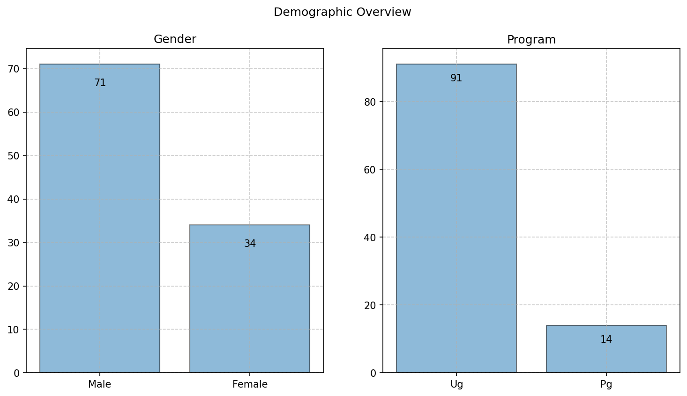
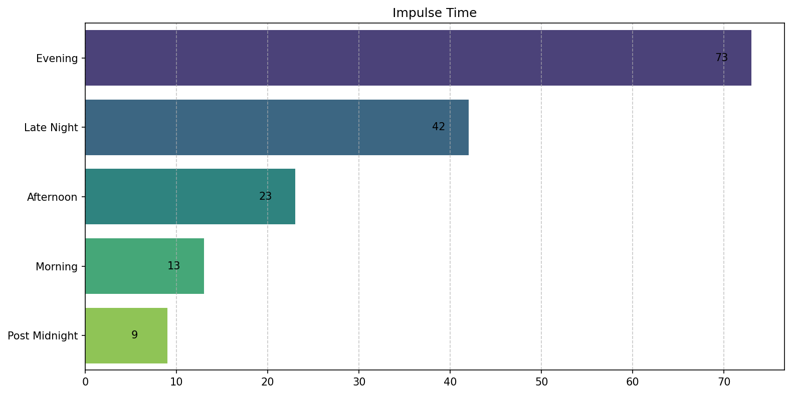
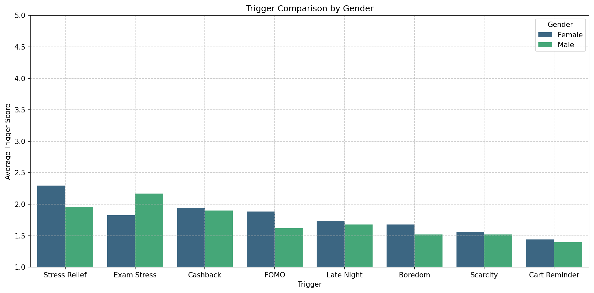
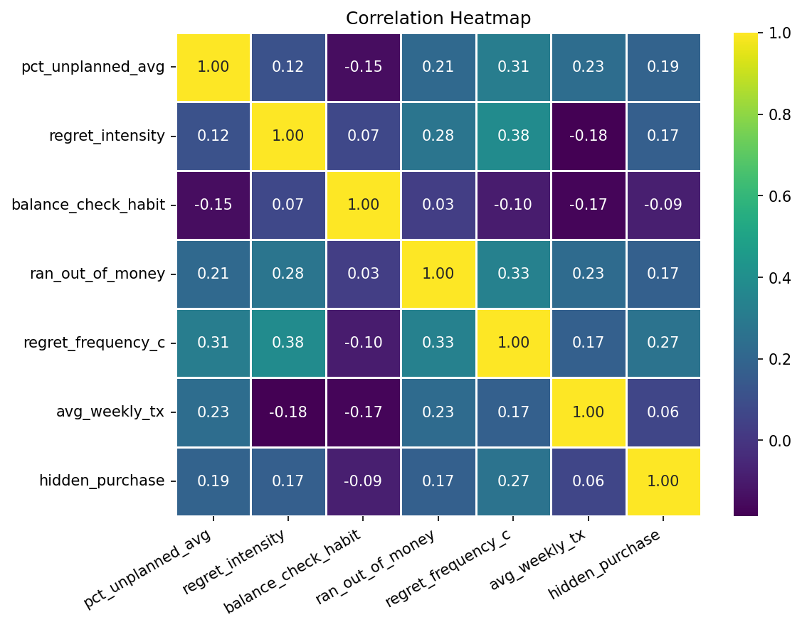
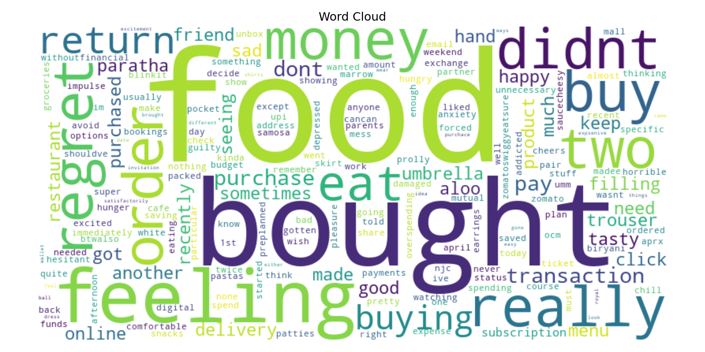
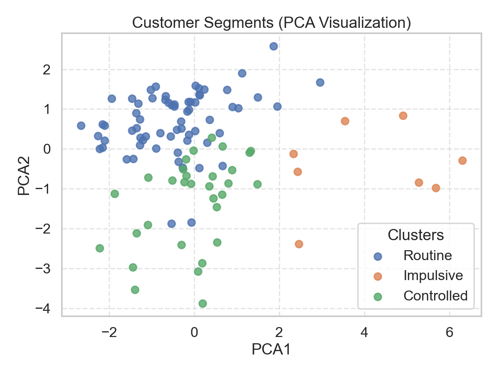
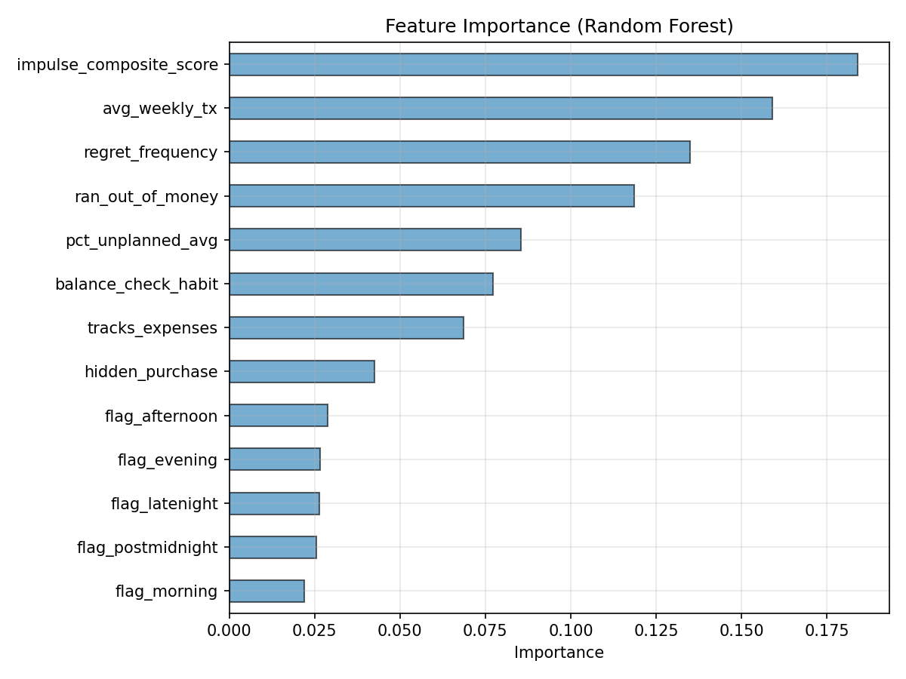

# 💸 UPI Impulse Trap Analysis

> Behavioral analytics of impulsive UPI spending and financial regret among Indian college students using Machine Learning, NLP, and Interactive Dashboards.

---

## 📌 Project Overview

The rapid adoption of UPI-based digital payments has transformed spending behavior among Indian college students.  
While frictionless transactions improve convenience, they also increase impulsive spending tendencies and post-purchase financial regret.

This project explores:

- Impulsive spending behavior
- Emotional and psychological spending triggers
- Financial regret patterns
- Behavioral spending personas
- Predictive risk modeling
- NLP-based regret analysis

using real survey data collected from Indian college students.

---

# 🚀 Live Dashboard
🌐 [Streamlit App](https://upi-impulse-analysis-263.streamlit.app/)

---

# 🧠 Key Features

## 📊 Behavioral Analytics
- Spending pattern analysis
- Unplanned purchase behavior
- Late-night transaction insights
- Financial regret analysis

## 🔥 Trigger Intelligence
- Stress-related spending triggers
- FOMO and cashback influence
- Emotional spending patterns
- Correlation analysis

## 🤖 Machine Learning
- Random Forest regret prediction
- Feature importance analysis
- Behavioral risk scoring

## 🧬 Persona Segmentation
- KMeans clustering
- Spending behavior personas
- Financial discipline profiling

## 📝 NLP Insights
- Regret text analysis
- WordCloud visualization
- Frequent regret keywords

## 📈 Interactive Dashboard
- Streamlit + Plotly dashboard
- Real-time filtering
- Interactive visualizations
- Fintech-style UI

---

# 🏗️ Project Architecture

```text
Raw Survey Data
       ↓
Data Cleaning & Encoding
       ↓
Exploratory Data Analysis
       ↓
NLP Processing
       ↓
Machine Learning Models
       ↓
Behavioral Personas
       ↓
Interactive Streamlit Dashboard
```

---

# 📂 Project Structure

```text
upi-impulse-analysis/
│
├── assets/
│
├── dashboard/
│   ├── app.py
│   ├── app_v1.py
│   └── .streamlit/
│       └── config.toml
│
├── data/
│   ├── raw/
│   ├── processed/
│   └── metadata/
│
├── notebooks/
│   ├── 01_data_cleaning.ipynb
│   ├── 02_eda.ipynb
│   ├── 03_nlp.ipynb
│   ├── 04_ml.ipynb
│   ├── 05_plotly_dashboard_prep.ipynb
│   └── 06_email_generation.ipynb
│
├── reports/
│   ├── Report.pdf
│   └── figures/
│
├── requirements.txt
└── README.md
```

---

# 📊 Dashboard Preview

## Executive Overview



---

## Spending Behaviour Analysis



---

## Trigger Intelligence



---

## Correlation Analysis



---

## NLP WordCloud



---

## Persona Segmentation



---

## ML Feature Importance



---

# 📈 Major Findings

## 🔹 Behavioral Insights
- Evening and late-night hours dominate impulsive spending.
- Food delivery and convenience purchases create the highest regret.
- Emotional triggers are stronger than social influence triggers.

## 🔹 Financial Patterns
- Students with frequent unplanned purchases report higher regret.
- Hidden purchases correlate with financial discomfort.

## 🔹 Machine Learning Insights
- Impulse score and transaction frequency are strong predictors of regret.
- Multiple behavioral spending personas exist among students.

---

# 🧬 Spending Personas

The project identifies multiple behavioral personas using KMeans clustering:

| Persona | Characteristics |
|---|---|
| Routine Evening Spenders | Convenience-driven evening spending |
| High Impulsive Spenders | High regret and impulsive behavior |
| Controlled Spenders | Financially disciplined users |

---

# 🤖 Machine Learning Pipeline

## Models Used

### Random Forest Classifier
Used for:
- Financial regret prediction
- Behavioral risk estimation
- Feature importance analysis

### KMeans Clustering
Used for:
- Behavioral persona segmentation
- Spending pattern grouping

---

# 🛠️ Tech Stack

| Category | Tools |
|---|---|
| Language | Python |
| Data Analysis | Pandas, NumPy |
| Visualization | Plotly, Matplotlib, Seaborn |
| Dashboard | Streamlit |
| Machine Learning | Scikit-learn |
| NLP | NLTK, TextBlob, WordCloud |

---

# 📑 Notebooks

| Notebook | Purpose |
|---|---|
| 01_data_cleaning.ipynb | Data preprocessing and encoding |
| 02_eda.ipynb | Exploratory Data Analysis |
| 03_nlp.ipynb | NLP processing and analysis |
| 04_ml.ipynb | Machine Learning models |
| 05_plotly_dashboard_prep.ipynb | Interactive Plotly visualizations |
| 06_email_generation.ipynb | Genreting insigts for mail |

---

# ⚠️ Limitations

- Dataset is based on a limited non-random student sample.
- Results should be interpreted as exploratory behavioral indicators.
- Findings may not generalize to all Indian students.

---

# 🎯 Future Improvements

- Real-time financial regret prediction
- Personalized spending recommendations
- Mobile responsive dashboard
- Deep learning NLP pipeline
- LLM-powered financial assistant

---

# 📄 Research Report
[Project Report](reports/Report.pdf)

---

# 👨‍💻 Author

## Rajnish
Indian Institute of Technology Bhilai  
Data Science and Artificial Intelligence

---

# ⭐ If You Like This Project

Consider giving this repository a star ⭐

---
